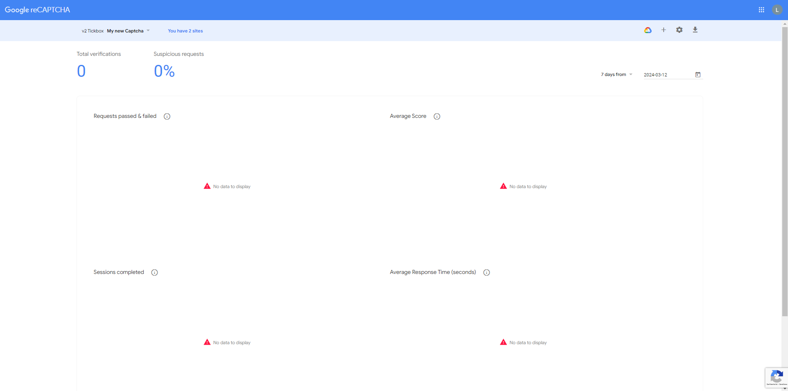

# Google reCAPTCHA

**Docs and sources**

- https://www.google.com/recaptcha/about/

- https://developers.google.com/recaptcha

- https://developers.google.com/recaptcha/intro

- https://developers.google.com/recaptcha/docs/display

- https://developers.google.com/recaptcha/docs/faq

- https://developers.google.com/recaptcha/docs/verify

- https://github.com/google/recaptcha

- https://www.youtube.com/watch?v=6Tw8pOmCC-g


## Create the reCAPTCHA

### Registration

- Go to https://www.google.com/recaptcha/about/

- Click on **v3 Admin Console**

- If we don't have no reCAPATCHA yet, Google wonders the creation of first reCAPATCHA :

1. Give a **Label** to captcha

2. Select the common method **reCAPTCHA type** :

    - Challenge (v2)

        - "I'm not a robot" tickbox 

3. Give **Domains**

    - For the development of the application, we choose 'localhost'.

    - Either we can add our wesite domain to have the same keys between development and production or add a new reCAPTCHA with our website domain.

4. Click on **SUBMIT**


### Keys

- We added our reCAPTCHA. We need the 2 keys in the project. We can copy them into a file from the project.

- Click on **GO TO ANALYTICS**


### Analytics

We find all statistics of reCAPTCHA.




### Settings

From the **analytics page**, we can click on the **cogwheel icon** if we want to modify the reCAPTCHA.


## Add dependencies and configuration file

### Google reCAPTCHA

This is the dependency from the project to get **Google reCaptcha**.

```bash
composer require google/recaptcha "^1.3"
```

### Replace constants

The *config.php* file implements **constants** with the reCAPTCHA keys.

We can look for the keys in the **index.php** and **verify.php** files.

We can replace the values of constants with our keys.

```php
<?php
// reCAPTCHA keys
define('reCAPTCHA_KEY', 'reCAPTCHA_key');
define('reCAPTCHA_SECRET_KEY', 'reCAPTCHA_secret_key');

```
